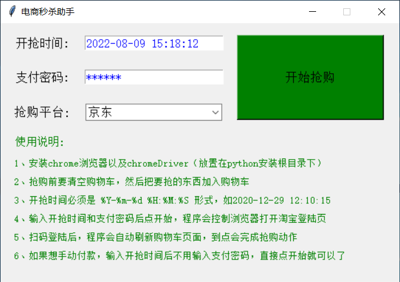
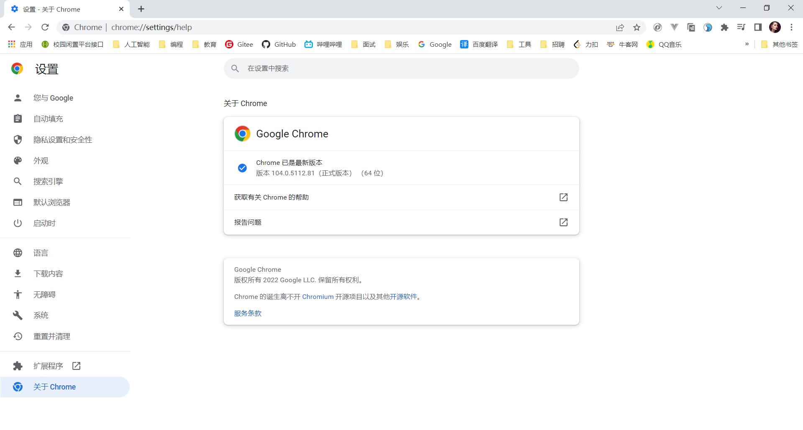
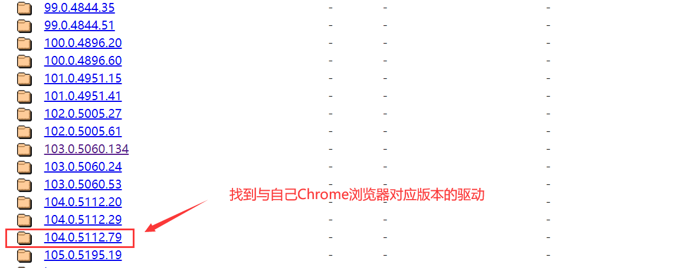

# seckill_tools
同时支持多种电商平台的商品秒杀（抢购）活动，如**淘宝、天猫、京东**商品秒杀等。

> 本项目是在作者 `jerry3747` 的仓库代码基础之上，进行了优化。
>
> 主要有：
>           1、优化了**秒杀代码的逻辑**，进行了**代码注释**，并优化了**脚本工具界面的外观**，可用性增强。
>
>   				2、功能增强，**新增了对京东平台的商品秒杀功能。**
>
> 如需要访问原仓库，移步 https://github.com/jerry3747/taobao_seckill 

## 工具依赖
#### 需要安装chrome浏览器，并且根据浏览器的版本找到对应的 [chromedriver]() 下载，解压到python安装的根目录下即可。

## Web版使用说明

1、抢购前请校准本地电脑的时间，再将需要抢购的商品加入到购物车（为防止出现未知错误，尽量将不需要抢购的商品清除）  
2、(可选) 如果要打包成可执行文件，可使用 `pyinstaller` 自行打包
3、不需要打包的，直接在项目根目录下，执行 python3 main.py 
4、(可选) 消息推送提醒（如微信/钉钉群机器人/邮箱等)，在 https://courier.toptopn.com/ 上免费注册账户，得到账户 `UUID` ，按照此网站的接口文档，在 `utils/utils.py` 中修改 `notify_user()` 中的参数即可。再执行 `python3 main.py`
5、程序运行后，输入抢购时间、支付密码、选择平台，点击抢购，则会自动打开淘宝/京东登陆页，需要自己手动点击切换到扫码登陆，扫码登录成功后，即可自动抢购。
